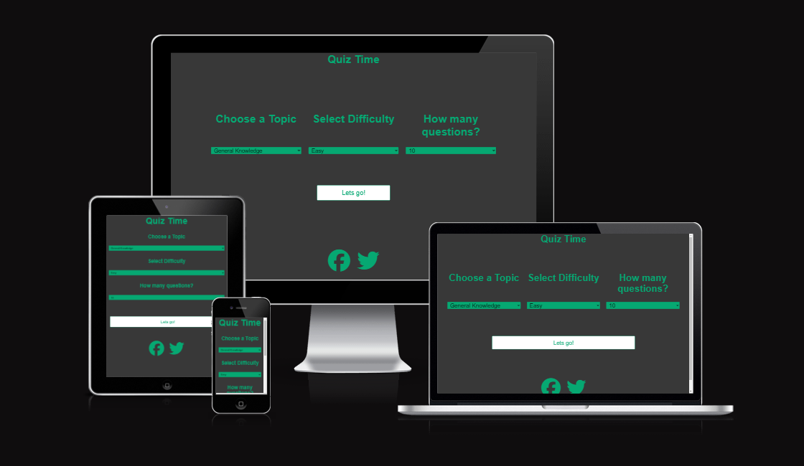
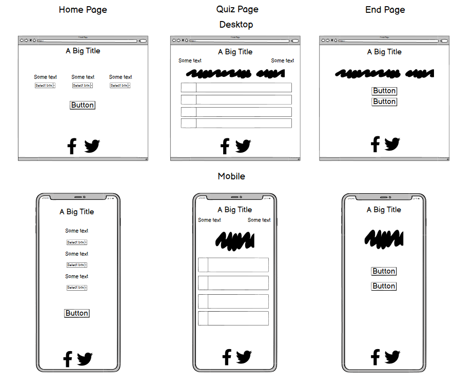

# Quiz Time

---

## Contents:

* UX
    * Project Goals
    * User Goals
    * User Stories
    * Designer Goals
    * Design Choices
        * Fonts
        * Colours       
* Wireframes
* Features
* Future Goals
* Technology Used
* Testing
    * Issues and Resolutions
* Known Bugs
* Deployment
* Credits
* Acknowledgements

---

## UX (User Experience)

### Project Goals

The goal of this project is to create a simple layout and an easy to use quiz that gets all data from a trivia API to allow for a constant feed of questions based on category, difficulty and the amount of questions that are all selected from the user. This gives the users a reason to come back and carry on playing when they have completed the quiz due to the option of different categories and difficulty.

### User goals

The main expected user could be anyone but expected to fall into any of these criteria

1. A casual user
2. Someone wanting a quiz to complete with little to invest
3. Quiz enthusiast

With regards to other sites online, this site ideally needs to be

1. Easy to use and navigate
2. Be quick and easy to start and complete
3. Be able to restart or select a new quiz once completed
4. Be updated with new content regularly
5. Visuallly appealing but not to confusing

### User stories

1. As a user i want the site to be easy to navigate with a simplistic yet colourful design
2. As a user i want to be able to choose what questions i am given
3. As a user i want to be able to select how hard the questions are so any any range can play it
4. As a user i want to be challenged!
5. As a user i want to come back and know i'm getting new questions not the same quiz over and over.

### Designer goals 

1. Create a simple but engaging quiz game
2. Minimise the need for constant updates by using API for data
3. Be engaging enough to make users want to come back after intial use.

### Design Choices

#### Fonts

Due to the simplistic approach of the design i decided to use one font so everything was consistent from the start to the end of my quiz. I decided on Arial as it is a
very easy to read font allowing content to be able to be easily read and understood on all devices.

#### Colours

After discussing various colour combinations with potential users of this site and googling different colour palletes, i decided upon the following colours allowing for a clean and simple colour pallet with good contrast ratios.

* Background color of page: #383838 
* Background color of answers: #fff
* Title & Content: #06a872
* Text and social icons: #06a872
* Text over answers: #06a872
 
---

## Wireframe Mockup:

---

## Features

The primary feature of this site is to provide a quiz application to users that will allow the users input on the type of quiz they complete. Explained more down below.

### Select a Category, Difficulty and Number of questions

The user is given the option to choose what topic of quiz they would like to complete. For younger users or for extremely smart users, they are offered a difficulty option ranging from Easy, Medium or Hard. Depending on if users would like a long quiz or a short quiz they are given the option from 10 to 25 questions to decide from.

### Correct/Incorrect Indication

When the user selects an answer they are presented with either a green background or a red background on the answer they picked to indicate if they were correct or incorrect.

### Full Playable Quiz To Users Choice

With the implementation of all of the above features, this allows the user to have a customised quiz to their liking.

---

## Future Goals

As this application develops going forward the future goals for the site are

### Leader Boards

Currently the user is presented with a score upon completion of the quiz, ideally in the future, the addition of a leader board could incentivise users to keep coming back and playing to try and beat their own score or someone elses.

### Timed Mode

In the future i would also like to add another option for the user to select called "Timed Mode". This option would provide the user with a time limit that they have to pick an answer for the given question in, if the user does not pick an answer in the time they automatically skip the question by default.

### Correct Annswer

In the future i would also add a feature where if the user has answered a question incorrectly the background colour of that answer would go red but the background of the correct answer would go green so the user would then know the right answer for next time.

---

## Technology Used

* HTML 
* CSS 
* JavaScript 
* [GitPod](https://codeinstitute-ide.net/) - The application used for all the coding
* [GitHub](https://github.com/) - To host the repositories for this project and the live 
website preview

---

## Testing

As this was my first time developing with the use of JavaScript and an external API to receive the quiz data from i ensured i was extremely thorough with testing to ensure that every function ran correctly and data was provide to the DOM correctly without any issues. By being thorough with all my testing it has greatly improved my understanding of JavaScript.

#### Test Planning

As this project is the most complex thing i have worked on, i wanted to ensure that a methodical approach was taken with constant feature testing throughout development. In it's initial state i created dummy html items to ensure data was being passed and displayed correctly and as expected. In future projects i will look to using more automated testing to aid me in my development. 

#### Testing Stories

* While i was developing the site i was told my colour pallete was a bit boring and generic, this is when i then decided to look for different alternatives and implemented a new colour scheme.

* Initially when i was planning i was going to add every question and correct answer individually until i came across the use of API which i found much easier to use and also sped up my progress. Due to the use of API i then decided to take full advantage of it and use the options for categories, difficulty and amount of questions.

---

## Overall:

### Responsiveness -
I spent a great amount of time making sure that my site was easily accesible and understandable on a multitude of different devices such as, a computer screen, an ipad, a small tablet, a regulared sized phone, and a small phone. I done this by making sure everything was easy to read and laid out in a manner that was easy to navigate, regardless what device the user is on.

### Design -
The main aim of my site was to use a simple but aesthetically pleasing colour pallet to help the site feel welcoming and easy to use. When choosing a colour pallet i used [contrast-ration.com](https://contrast-ratio.com/) to ensure my choices are eligible and easy to read.

### Features -

#### Self Populating Category List

##### Plan: 
Initially when i was planning i wasnt going to use an API, but when i discovered what they were and how i could use them i realised the wide variety of categories the API i had found had and wanted the category option to be self-populating by the API due to the creator of the API adding more categories.

##### Implementation:
When researching the API documentation, i found the site offered their categories list as a separate API. When loading the site, i used the fetch API to obtain this list which is then sorted and passed across to the DOM.

##### Result:
The categories list drop down operates as expected, populating the API data to the DOM allowing the user to select their chosen category and using that information for what questions are pulled from the API.

***

#### Fully Playable Quiz

##### Plan:
The main aim of the project was to have a fully playable quiz where the questions that were displayed were entirely depicted from the choices provided by the user, sourced from an external API which is constantly being updated.

##### Implementation:
While reviewing the API documentation, I set up a variable to store the base URL needed to fetch the data. I then completed the URL using the user's selections. Once these variables were established, I used the Fetch API to retrieve the data, convert it to JSON, and applied the .map() function to make the data usable. I then placed the answers into an array and randomized their order to ensure that when the question is accessed again during the playthrough, the answers are displayed in a different order each time.

##### Result:
The quiz operates as planned, the user is given the chosen quiz in full working order without any bugs.

***

#### End Of Game Options

##### Plan:
At the end of the game the aim was to provide the user with the choice to play the game again with the same choices or to go back to the start to choose a new category,difficulty or amount of questions.

##### Implementation:
When creating the results page i decided the best approach would be to give the user two buttons, one to restart the exact same quiz, the other to go back to the start of the game and offer the choices again.

##### Result:
This worked as expected with little effort.

***

### Issues and resolutions
During development of this project i encountered a wide range of bugs which slowed down progress, below are examples of the larger bugs and the fixes.

##### Bug:
Div's not being hidden when intented to.

##### Fix:
To fix this i reviewed my code and tried to logically read through it all to make sure i was implementing the "classList" at the correct places in the code.

##### Result:
This fixed the issue and allowed Div's to be hidden or unhidden when they needed to be.

***

##### Bug:
Functions not working as expected due to them being undefined.

##### Fix:
This was due to me defining variables inside of a function which then meant they could not be used in other functions. I fixed this by defining them at the top of my quiz.js page.

##### Result:
When this was changed the functions would work correctly and i would no longer get the undefined error.

***

##### Bug
The div with the id of "end" was not working.

##### Fix
To fix this i discovered that i did not have the script src="quiz.js" at the end of my html, under the div with the end of "end".

##### Result
The div was working as intended.

***

##### Bug
Categories with less than requested questions returned with nothing.

##### Fix
When i looked into this i discovered that when a category did not have enough questions to provide the user with the amount they chose no questions would load at all. I fixed this by adding an if statement to declare if there is any data within the array, if there isnt then an error message telling the user "Error: No questions available for the selected category and difficulty. Please try again with a different selection." would display.

##### Result
I don't feel this is the perfect solution to the issue but ensures the game still works as expected.

***

##### Bug
Loading wheel would not display correctly, instead of displaying before a div would be unhidden it would display at the top of the screen.

##### Fix
After investigating i realised that i had placed the classes and Id's into the wrong divs. By moving them into the correct one it would then work.

##### Result
The loading wheel would now display before a div is unhidden making for a smooth experience.

## Deployment

To deploy this page to GitHub Pages from its [GitHub repository](https://github.com/ryan-a-davis365/Quiz-Time), the following steps were taken: 

1. From the menu items near the top of the page, select **Settings**.
2. Scroll down to the **GitHub Pages** section.
3. Under **Source** click the drop-down menu labelled **None** and select **Master Branch**
4. On selecting Master Branch the page is automatically refreshed, the website is now deployed. 
5. Scroll back down to the **GitHub Pages** section to retrieve the link to the deployed website.

## Credits

### Content

* API data source from [opentdb](https://opentdb.com/)
* The favicon was edited by me. The original: (https://static.vecteezy.com/system/resources/previews/016/062/449/original/quiz-logo-icon-symbol-cartoon-yellow-bubble-speech-vector.jpg)
* Loader based on W3 schools lesson [w3schools](https://www.w3schools.com/howto/howto_css_loader.asp)
* Icons in the footer were taken from Font Awesome.
* All content was written by myself but with the help from some of the Love Maths code...........

### Acknowledgements

Richard Wells (mentor) - He went above and beyond and helped me massively with understanding javascript and helping me to think logically and fix my errors.

Ellis Fraser (friend) - He went out of his way multiple times to give my code a read through and tell me roughly where i had gone wrong, couldnt of completed this without his help.

My family - They have motivated me and pushed me to keep going, even when i am struggling.

My girlfriend - For constantly being supportive of me and giving me the time and space to complete this project.

## Disclaimer
Please note the content and images on this website are for educational purposes only.